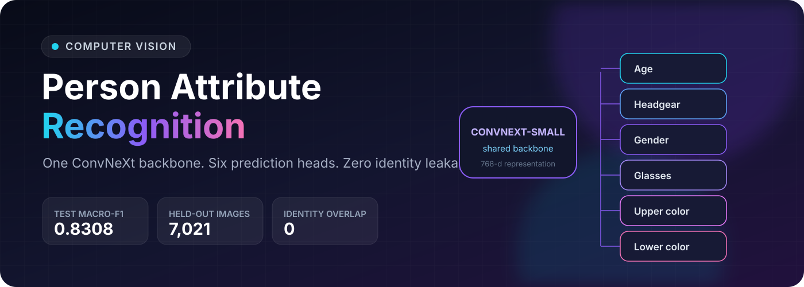
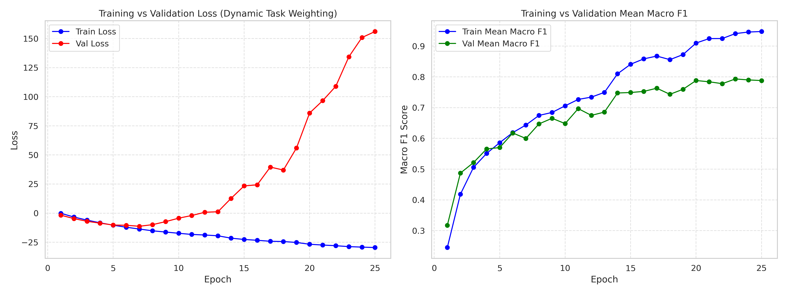
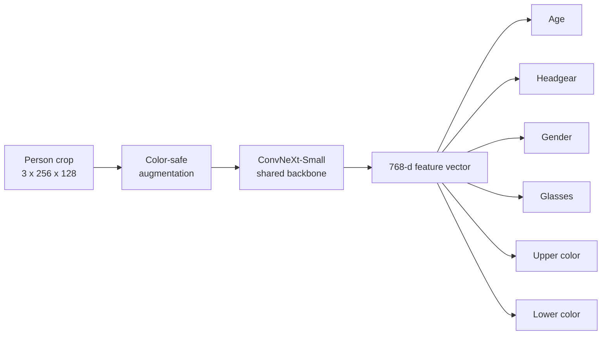
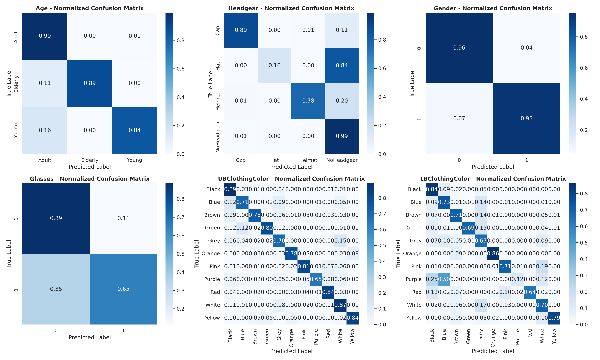

<p align="center">
  
</p>

<p align="center">
  <a href="https://github.com/aish-1509/person-attribute-recognition-convnext/actions/workflows/ci.yml"></a>
  <a href="LICENSE"></a>
  <a href="https://www.python.org/"></a>
  <a href="https://pytorch.org/"></a>
</p>

An end-to-end computer vision system that predicts six pedestrian attributes from one crop using a shared ConvNeXt-Small backbone. The project is designed around the part that is easiest to miss: trustworthy evaluation. Person identities are isolated across train, validation, and test splits to prevent memorization from inflating the result.

> **Held-out test mean macro-F1: 0.8308** across age, headgear, gender, glasses, upper-body color, and lower-body color.

## Results

| Attribute | Accuracy | Macro Recall | Macro F1 |
|---|---:|---:|---:|
| Age | 0.9909 | 0.9180 | **0.9334** |
| Headgear | 0.9872 | 0.9661 | **0.8849** |
| Gender | 0.9548 | 0.9545 | **0.9541** |
| Glasses | 0.8476 | 0.7448 | **0.7425** |
| Upper-body color | 0.8137 | 0.7734 | **0.7688** |
| Lower-body color | 0.8100 | 0.7135 | **0.7011** |

The best validation checkpoint was selected at epoch 23 with a validation mean macro-F1 of **0.7933**. Final test metrics were computed once from that checkpoint on 7,021 held-out images.

<p align="center">
  
</p>

## What I Built



- **Leakage-safe data design:** extracts person IDs from Market-1501-style filenames and uses group-aware splitting with zero identity overlap.
- **One deployable model:** a shared ConvNeXt-Small backbone with six task-specific heads, rather than six independent networks.
- **Three-axis imbalance handling:** inverse-square-root class weights, focal loss, and learned homoscedastic task weighting.
- **Label-safe augmentation:** preserves clothing colors by avoiding hue and saturation transforms while simulating geometry, brightness, noise, and JPEG artifacts.
- **Evaluation that matches the risk:** checkpoints on mean macro-F1 so rare classes count, then inspects normalized confusion matrices for failure modes.

## Failure Analysis

The confusion matrices make the remaining product risks visible: glasses are limited by spatial resolution, rare hats are often absorbed into the dominant no-headgear class, and dark lower-body colors remain ambiguous under shadows and compression.

<p align="center">
  
</p>

## External-Domain Demo

<p align="center">
  
</p>

The released checkpoint reproduces the overlay shown above. Its lowest confidence on this image is the glasses prediction, which is consistent with the model's measured failure mode.

## Quick Start

```bash
git clone https://github.com/aish-1509/person-attribute-recognition-convnext.git
cd person-attribute-recognition-convnext
python -m venv .venv
source .venv/bin/activate
pip install -e .

curl -L \
  -o models/best_model.pth \
  https://github.com/aish-1509/person-attribute-recognition-convnext/releases/download/v1.0.0/best_model.pth

par-predict assets/demo/external_inference.jpg \
  --checkpoint models/best_model.pth
```

Example output:

```json
{
  "Age": {"label": "Adult"},
  "Headgear": {"label": "NoHeadgear"},
  "Gender": {"label": "Female"},
  "Glasses": {"label": "No"},
  "UBClothingColor": {"label": "Red"},
  "LBClothingColor": {"label": "Blue"}
}
```

The CLI also returns a confidence score and the checkpoint's raw class value for every attribute.

## Repository Guide

| Path | Contents |
|---|---|
| [`src/par_model`](src/par_model) | Reusable architecture, checkpoint loader, preprocessing, and inference CLI |
| [`notebooks/person_attribute_recognition.ipynb`](notebooks/person_attribute_recognition.ipynb) | Full experiment, training pipeline, evaluation, and diagnostics |
| [`results`](results) | Per-epoch training log and 7,021 held-out predictions |
| [`assets/results`](assets/results) | Learning curves and normalized confusion matrices |
| [`docs/PAR_Defense_Deck.pdf`](docs/PAR_Defense_Deck.pdf) | 15-page visual project defense |
| [`MODEL_CARD.md`](MODEL_CARD.md) | Intended use, limitations, metrics, and responsible-use notes |
| [`docs/application_response.md`](docs/application_response.md) | Concise portfolio and project explanation |

## Run Checks

```bash
pip install -e ".[dev]"
ruff check .
pytest
```

## Honest Scope

This was built as an evaluated take-home prototype, not a production system with external users. The work demonstrates full ownership of problem framing, data risk discovery, modeling, evaluation, inference packaging, and technical communication. It should not be used for consequential decisions or identity inference. See the [model card](MODEL_CARD.md) for details.

## Artifacts

The 189 MB checkpoint is published in the repository's [v1.0.0 release](https://github.com/aish-1509/person-attribute-recognition-convnext/releases/tag/v1.0.0), keeping normal clones fast. The training dataset is not redistributed.

The qualitative demo image was sourced from [Unsplash](https://images.unsplash.com/photo-1515347619152-c3bf79133612) and is included only to illustrate external-domain inference.

## License

Code is released under the [MIT License](LICENSE). Model use remains subject to the terms of the data used to train it.
